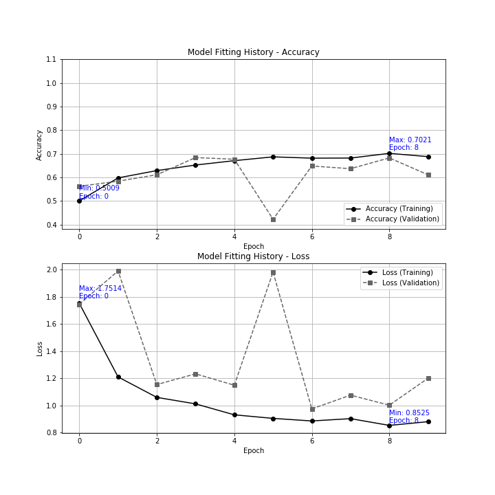

# Diabetic_Retinopathy_Detection
Classification of Images for detection of various stages of diabetic retinopathy, a disease which can lead of blindness.

# Technologies Used

* Python, Jupyter Notebook

* Keras
    * Image Data Generator with flow_from_directory method to read training, validation, and testing images
    * Convolutional Neural Network model
    * Definition, Compilation, Fit, Evaluation of the model
    * Image Augmentation

* Matplotlib

# Reference

* GitHub: https://github.com/daddyjab/Diabetic_Retinopathy_Detection

* Jupyter Notebook with Analysis and Report:
    * Report-Diabetic_Retinopathy_Augmented-96x96,64,128-DesktopCPUOnly.ipynb: 
    https://github.com/daddyjab/Diabetic_Retinopathy_Detection/blob/master/Report-Diabetic_Retinopathy_Augmented-96x96%2C64%2C128-DesktopCPUOnly.ipynb

# Visualizations

| Figure: Diabetic Retinopathy Detection - Model Fitting History |
|----------|
|  |
